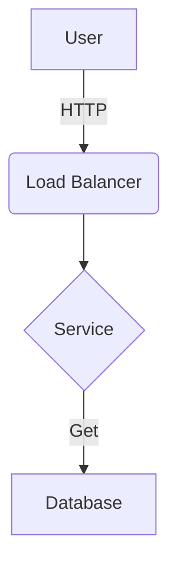

# Markdown Style Guide

## 1. Introduction
This guide establishes the standards for all Markdown content in this repository. It adheres to **GitHub Flavored Markdown (GFM)**.

**Core Principle:** Source readability is as important as rendered output. Raw Markdown should be clean, scannable, and consistent.

---

## 2. File Naming
* **Rule:** Use `kebab-case` for all filenames.
* **Rule:** Use the `.md` extension (not `.markdown`).
* **Why:** Ensures compatibility across Linux/Unix systems and URLs.
    * ✅ Good: `incident-response-plan.md`
    * ❌ Bad: `Incident Response Plan.MD`

---

## 3. Headings
Use ATX-style (hash) headings.
* **Rule:** Put a space after the hash (`# Title`).
* **Rule:** Use **Sentence case** for headings (only capitalize the first word and proper nouns).
* **Rule:** Do not skip levels (e.g., do not jump from `##` to `####`).
* **Rule:** Ensure a blank line precedes every heading.

```markdown
# Project Phoenix
## System requirements
### Software dependencies
```

---

## 4. Text Formatting
- Paragraphs: Separate by a single blank line.
- Bold: Use double asterisks: **text**.
- Italic: Use single asterisks: *text*.
- Line Breaks: Do not use trailing spaces. If a hard break is strictly necessary, use `<br>`.

---

## 5. Lists
- Unordered: Use hyphens (-) for all levels.
- Ordered: Use 1. for every item. This makes reordering easier (the renderer handles the numbering).
- Spacing: Indent nested lists by 4 spaces.

```markdown
- Cloud provider
    - AWS
    - Azure
1. Initialize repo
2. Commit code
3. Push changes
```

---

## 6. Code & Command Line
- Inline: Use single backticks: `variable_name`.
- Blocks: Use triple backticks with a language identifier.
- Filenames: When showing code, comment the filename at the top of the block if relevant.

````Markdown
```python
# main.py
def health_check():
    return "OK"
```
````

---

## 7. Links & Images
- Relative Links: Always use relative paths for internal links to ensure they work in forks/clones.
  - ✅ [Home](../README.md)
  - ❌ [Home](https://github.com/org/repo/blob/main/README.md)
- Images: Must include descriptive alt text.
  

---

## 8. Alerts (Admonitions)
Use GitHub-standard alerts for notes, warnings, and tips. Do not use blockquotes (>) for standard text.

```markdown
> [!NOTE]
> Useful information that users should know, even when skimming.

> [!IMPORTANT]
> Crucial information necessary for the user to succeed.

> [!WARNING]
> Critical content demanding immediate user attention due to potential risks.
```

---

## 9. Diagrams (Mermaid)
- Prefer code-based diagrams over static images for version control.
- Use Mermaid.js.

````markdown

````

---

## 10. Tables
- Use pipes | and hyphens -.
- Align columns using colons.
- Format header rows in Title Case.

```markdown
| Service Name | Port | Protocol |
| :--- | :---: | ---: |
| Web App | 80 | HTTP |
| Database | 5432 | TCP |
```

---

## 11. Linting & Validation
- This repository enforces these rules via markdownlint.
- Line Length: Target 80-120 characters where possible, but do not break URLs.
- Trailing Spaces: Remove all trailing whitespace.
- Multiple Blank Lines: Avoid more than one consecutive blank line.