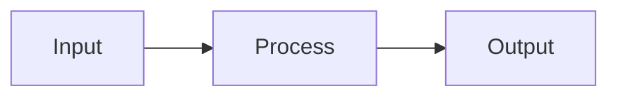
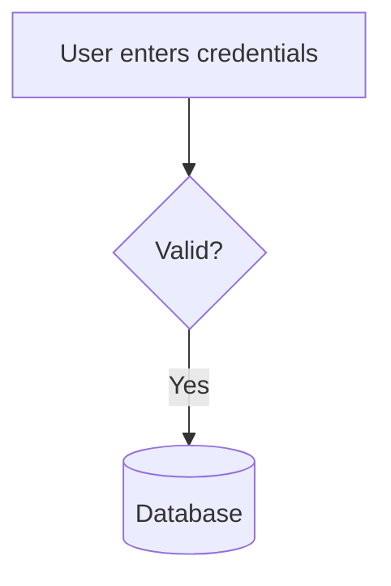
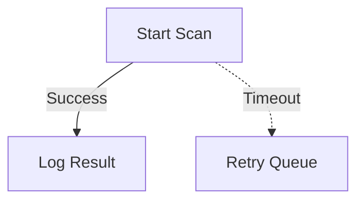
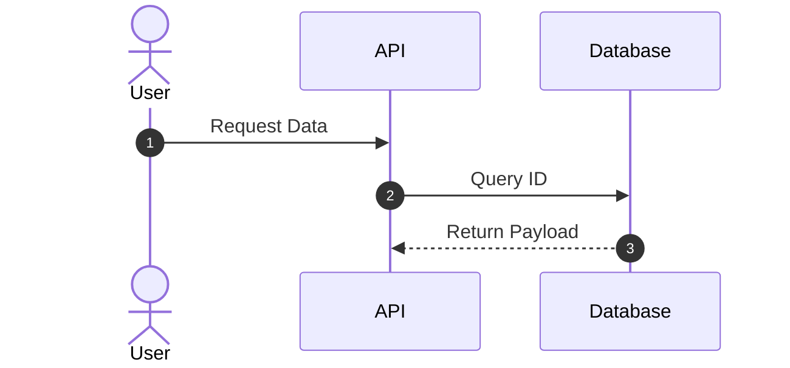
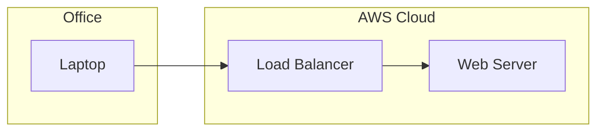
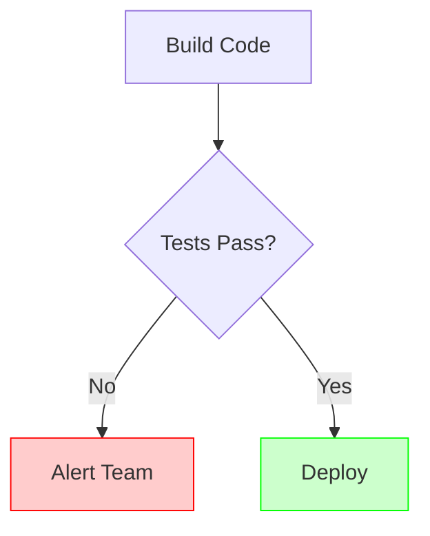

<mermaid_style>

# Mermaid Diagram Style Guide

## 1. Introduction
This guide establishes standards for creating code-based diagrams using **Mermaid.js**. Because diagrams are treated as code, they must be clean, readable, and version-controllable.

**Core Principle:** A diagram's source code should be as readable as the rendered image.

## 2. Graph Direction
Choose the orientation based on the data flow.
* **Rule:** Use `TD` (Top-Down) for hierarchies, decision trees, and organizational charts.
* **Rule:** Use `LR` (Left-Right) for pipelines, timelines, and sequential data flows.
* **Rule:** Use `flowchart` instead of the older `graph` keyword for better rendering support.

>Example of Top-Down:

## 3. Node Identifiers

Separate the **Node ID** from the **Node Label**.

* **Rule:** Use semantic, `kebab-case` or `snake_case` IDs. Avoid single letters (`A`, `B`, `C`).
* **Rule:** IDs must be descriptive enough to understand links without reading the label.
* **Why:** If you change the label text later, you won't break the logic/connections.

**Good:**

**Bad:**

## 4. Standard Shapes

Use consistent shapes to convey meaning immediately.

* **Rule:** Use `[]` (Rectangle) for standard processes/steps.
* **Rule:** Use `{}` (Rhombus) **only** for decisions/conditionals.
* **Rule:** Use `[()]` (Cylinder) for databases and storage.
* **Rule:** Use `(())` (Circle) for start/end points or connectors.

## 5. Connections & Arrows

Keep connections clean.

* **Rule:** Use `-->` for standard flow.
* **Rule:** Use `-.->` (dotted) for optional, asynchronous, or future flows.
* **Rule:** Add text labels to arrows *only* when a decision is made or the relationship needs clarification.
* **Rule:** Use pipes `|text|` for arrow labels, not the older syntax.

## 6. Sequence Diagrams

For showing interactions over time.

* **Rule:** Always enable `autonumber` to make referencing steps in conversation easier.
* **Rule:** Define `participant` or `actor` aliases at the top for clarity.

## 7. Subgraphs (Grouping)

Use subgraphs to cluster related components (e.g., separating "Cloud" from "On-Prem").

* **Rule:** Indent subgraph content by **4 spaces**.
* **Rule:** Give subgraphs descriptive IDs.
* **Rule:** Label the subgraph clearly using the `subgraph ID [Label]` syntax.

## 8. Styling (Classes)

Do not use inline styles (e.g., `style A fill:#f9f`). It creates "spaghetti code."

* **Rule:** Use `classDef` at the bottom of the file to define themes.
* **Rule:** Apply classes using the `:::` operator.
* **Standard Classes:**
* `classDef failure fill:#f88,stroke:#333;`
* `classDef success fill:#8f8,stroke:#333;`

**Example:**

## 9. Linting & Formatting

* **Indentation:** Use 4 spaces for nested elements.
* **Spacing:** Put spaces around arrow connectors for readability (`A --> B`, not `A-->B`).
* **Comments:** Use `%%` for comments to explain complex logic.

## 10. Quick Cheat Sheet

| Type | Syntax | Output Shape |
| --- | --- | --- |
| Process | `id[Text]` | Rectangle |
| Decision | `id{Text}` | Diamond |
| Database | `id[(Text)]` | Cylinder |
| Terminal | `id([Text])` | Rounded Pill |
| Subroutine | `id[[Text]]` | Double Border |
| Comment | `%% Text` | Invisible |

</mermaid_style>
